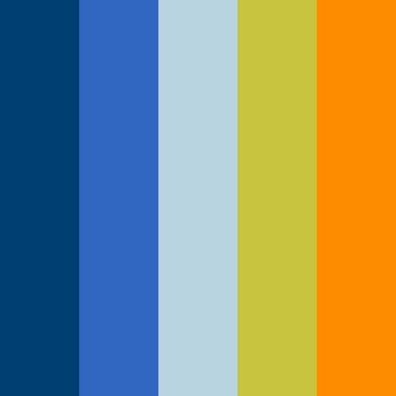

# Remain Software Artwork and Trademarks

## Policy
Please note that the content hosted here is intellectual property of Remain BV, Nieuwegein ("Remain").
Usage of this content ("Trademarks") is outlined in the [POLICY.MD](POLICY.MD) file.

## Remain Software
Remain Software's main logo is an artistic impression of the Triscle, an ancient symbol depicting the perpetuate cycle of life.

The logo may include the words Remain and Software as follows:

## Colors
The colors used by the Trademarks are:

#### Dark Blue
* #003F70
* 0,63,112
 
#### Bright Blue
* #3066BE 
* 48,102,190
 
#### Light Blue
* #b7d3e2
* 183, 211, 226
 
#### Logo Color
* #c8c442
* 200,196,66
 
#### Orange
* #ff8c00
* 255, 140, 0
 

